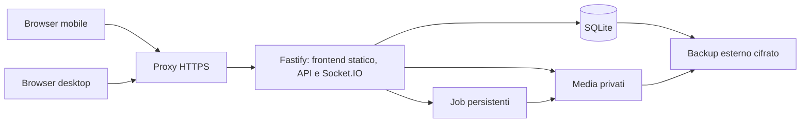

# Architettura e gestione

Il provider scelto è Railway, con budget obiettivo di 5–10 €/mese e preferenza
per minore manutenzione. La configurazione proposta usa un solo servizio
con frontend web, API, realtime, database SQLite e media su volume persistente.
La CLI 4.30.5 risulta autenticata; la cartella non è collegata a un progetto.
Non sono state create risorse né verificato il piano di fatturazione attivo.

## Componenti confermati e stato iniziale

Lo stack è confermato. La struttura locale contiene frontend, backend,
contratti condivisi, migrazioni e test; le dipendenze sono fissate nel
lockfile. Usa Node.js 22.18+ della serie 22 in locale e l'immagine Node 22
nel container. La chat completa descritta di seguito resta da implementare.
Vedi [Sviluppo locale e deployment](09-sviluppo-locale.md).

| Componente | Scelta proposta | Motivazione |
| --- | --- | --- |
| Frontend | React, Vite e TypeScript | Applicazione interattiva senza necessità di SEO o rendering server. |
| Stile | CSS con variabili di tema e componenti locali | Controllo preciso dell'aspetto e pochi vincoli esterni. |
| API | Node.js LTS supportato e Fastify | Un solo processo applicativo, validazione e upload controllati. |
| Realtime | Socket.IO | Connessione, riconnessione e stanze; persistenza gestita dall'app. |
| Database | SQLite in WAL con migrazioni SQL versionate | Volume ridotto, transazioni e backup locali semplici. |
| Accesso SQL | Driver SQLite per Node e query parametrizzate | Vincoli visibili, senza ORM obbligatorio. |
| Media | Directory privata su volume persistente | Gestione diretta adatta alla scala richiesta. |
| Conversione | FFmpeg in processo separato controllato | Derivati audio/video dove necessari. |
| HTTPS | Ingresso gestito Railway | Un'origine per frontend, API e realtime; nessun proxy Caddy separato. |
| Packaging | Un container applicativo e un volume | Frontend compilato servito da Fastify; deployment riproducibile. |

Un hosting che interrompe processi inattivi o non garantisce disco persistente
non è compatibile con questa architettura. Un'alternativa con Postgres e
storage privato gestiti rimane possibile, ma richiede rivedere deployment,
backup e accesso ai file; non è una dipendenza della prima versione.

## Percorso dei dati

Il browser usa la stessa origine per pagine, API, download e realtime,
riducendo la configurazione di cookie e CORS.

I job possono essere eseguiti dallo stesso servizio con una coda persistita
in SQLite. Limitare a una conversione media e un'importazione alla volta;
non serve introdurre Redis. I processi FFmpeg hanno timeout e limiti di
risorse e non ricevono parametri shell costruiti da input utente.

## Messaggi affidabili

Socket.IO ordina gli eventi ricevuti ma non garantisce da solo il recupero
degli eventi persi: la documentazione dichiara consegna predefinita al massimo
una volta. La persistenza e il recupero seguenti sono responsabilità
dell'applicazione. Vedi [Socket.IO delivery guarantees](https://socket.io/docs/v4/delivery-guarantees/).

1. Il client salva in IndexedDB un invio con `clientMessageId` casuale e ne
   mostra la bolla provvisoria. Se la persistenza locale fallisce, segnala
   che la coda non è protetta da un reload.
2. Invia via HTTP. Il server autentica e valida il contenuto e gli allegati.
3. In un'unica transazione inserisce il messaggio, assegna la sequenza,
   inserisce l'evento nell'outbox e registra la chiave idempotente.
4. Dopo il commit risponde con il messaggio canonico. Solo ora il client
   mostra **Inviato** e rimuove l'elemento dalla coda.
5. Il dispatcher pubblica l'evento persistito; eventuali ripetizioni vengono
   ignorate per `eventId`. Un crash fra commit e pubblicazione viene recuperato.
6. Alla riconnessione il client richiede gli eventi successivi all'ultimo
   cursore applicato e unisce le nuove notifiche realtime per ID e versione.

Retry con attesa esponenziale e jitter fino a 30 secondi; i fallimenti
temporanei restano in coda. Gli errori di autorizzazione o validazione
richiedono intervento e non generano retry infiniti. Chiavi identiche con
payload diverso restituiscono conflitto. Il client preserva l'ordine della
propria coda; fra due dispositivi vale l'ordine assegnato dal server.

Una lettura degli eventi restituisce un watermark `headEventSeq`. Il client
si iscrive al realtime, bufferizza gli eventi in arrivo, recupera dal proprio
cursore fino a quel watermark e applica poi il buffer in ordine. Un salto
di sequenza forza un nuovo recupero. Al riavvio della pagina richiede anche
lo stato canonico dei messaggi visibili.

## Media e registrazione

Gli upload arrivano in staging e diventano allegabili soltanto nello stato
`ready`. Conserva l'originale e produci thumbnail e derivati riproducibili.
Un allegato può comparire in un messaggio solo se appartiene al membro e
alla conversazione corretti.

Per registrare audio, usa `getUserMedia` e `MediaRecorder` in HTTPS, scegliendo
il formato a runtime con `MediaRecorder.isTypeSupported`. Il supporto
dichiarato non elimina possibili errori di risorse: gestisci anche avvio,
interruzione e blob vuoto. Vedi [MDN MediaRecorder](https://developer.mozilla.org/en-US/docs/Web/API/MediaRecorder/isTypeSupported_static).

Non assumere che ogni browser riproduca gli `.opus` dell'export. Produrre,
dove necessario, un derivato AAC in contenitore MP4 e verificarlo sui
dispositivi target; conservare sempre l'originale. Per i video generare
poster e verificare codec effettivi, non solo estensione `.mp4`. Conversioni
fallite mostrano un errore recuperabile e lasciano disponibile il download.

| Parametro | Valore iniziale proposto |
| --- | --- |
| Immagine | Massimo 20 MiB per file. |
| Video/documento | Massimo 100 MiB per file. |
| Vocale | Massimo 10 minuti e 25 MiB, vale il primo limite raggiunto. |
| Import ZIP | Massimo 250 MiB compressi, 1 GiB estratti, 10.000 file. |
| Rapporto ZIP | Rifiutare oltre 100:1 per file o per archivio. |
| Testo export | Massimo 20 MiB; parsing con avanzamento e memoria limitata. |
| Storage | Budget applicativo iniziale 3 GB per dati finali; avviso a 80%, stop nuovi upload a 95%. |
| Volume dati | 5 GB proposti su Railway Hobby, con margine per staging, derivati e database. Verificare spazio libero prima di ogni import. |

I valori sono configurabili e valgono anche sul server e sul proxy. Il
campione occupa circa 37,88 MiB; derivati, staging e backup richiedono spazio
aggiuntivo. L'esaurimento disco deve bloccare in modo esplicito i nuovi invii
non persistibili, senza conferme false.

## Offline, PWA e presenza

La PWA conserva in cache soltanto la shell statica versionata. API e media
autenticati usano `Cache-Control: private, no-store`; niente cache
indiscriminata nel service worker. IndexedDB conserva bozze e coda locale
per chat e membro;
logout e revoca rilevata le eliminano. La lettura offline completa dello
storico non è un requisito P0.

I messaggi testuali pendenti si inviano quando l'app torna attiva e online.
Per i file, mantieni il blob locale se possibile; se manca dopo un reload,
chiedi di riselezionarlo. Non promettere upload o registrazioni in background.
Un heartbeat ogni 20 secondi mantiene la presenza; dopo 60 secondi senza
riscontro il membro è offline. Lo stato **Sta scrivendo** scade dopo 5 secondi
e non viene salvato nel database storico.

Push: registrare subscription per dispositivo, custodire le chiavi VAPID sul
server, revocare le subscription non valide e usare una coda persistente con
chiave univoca evento/dispositivo. Inviare solo per messaggi nativi destinati
all'altro membro, con contenuto generico; annullare i job non inviati se nel
frattempo il messaggio risulta letto. Il realtime resta indipendente dai push.

## Deployment e configurazione

La prima installazione proposta usa un servizio Railway sempre attivo, una
replica e un volume montato in `/data`. SQLite, media e staging occupano
sottodirectory distinte del volume. L'immagine contiene FFmpeg ed esegue una
sola conversione alla volta. Non attivare lo sleep nella baseline, perché
job e notifiche devono funzionare anche senza una pagina aperta.

Hobby prevede un minimo di 5 USD/mese incluso nell'utilizzo, non 5 USD da
sommare nuovamente ai consumi. Il listino indica fino a 5 GB di volume.
Usare inizialmente un dominio Railway evita l'acquisto di un dominio dedicato.
Il piano attuale dell'account resta da verificare. Vedi il
[listino Railway](https://railway.com/pricing).

Il budget di 5–10 € è un obiettivo, non un prezzo garantito: conteggiare CPU,
RAM, volume, traffico, backup e imposte applicabili. La fatturazione in USD
introduce anche la variabilità del cambio. Misurare una settimana di uso
reale e separare il picco di importazione dal consumo ordinario; i consumi
di eventuali altri progetti del workspace non appartengono a questa chat.

Proporre avvisi di spesa prima di raggiungere il budget. Un hard limit può
spegnere i workload del workspace: non impostarlo automaticamente su un
account esistente. Vedi i
[controlli di costo Railway](https://docs.railway.com/pricing/cost-control).
La destinazione del backup esterno resta da scegliere all'interno del budget.

Configurazioni da prevedere: `PUBLIC_ORIGIN`, `DATABASE_PATH`, `MEDIA_ROOT`,
`IMPORT_STAGING_ROOT`, `ADMIN_CREDENTIAL_HASH`, chiavi VAPID, destinazione
backup, limiti media e retention. I segreti restano fuori da Git e dal bundle.
Il processo gira come utente senza privilegi, con accesso in scrittura solo
ai volumi necessari. Il servizio ascolta sulla porta assegnata da Railway;
SQLite non ha una porta pubblica. Un redeploy con volume comporta una breve
interruzione e deve essere recuperato dalla sincronizzazione del client.
Vedi i [vincoli dei volumi Railway](https://docs.railway.com/volumes/reference).

La pipeline verifica tipi, build e test, produce un'immagine versionata e
applica migrazioni dopo un backup. Documentare per ogni migrazione se il
rollback del solo codice è compatibile con lo schema. Altrimenti ripristinare
insieme codice, database e media nella finestra di manutenzione.

## Backup, ripristino e manutenzione

Il backup deve includere un'istantanea coerente di database, media e manifest
con checksum. Copiare soltanto il file SQLite attivo può perdere lo stato
nel WAL: usare l'API di backup o un metodo supportato. Vedi
[SQLite Online Backup](https://www.sqlite.org/backup.html).

1. Sospendi brevemente mutazioni e job di pulizia/conversione; lascia le
   letture disponibili e segnala manutenzione agli invii.
2. Crea l'istantanea SQLite con un metodo supportato e registra i file
   referenziati con checksum. I media finali sono immutabili.
3. Copia i media referenziati mentre la pulizia resta sospesa. Verifica
   checksum e integrità database, poi riabilita tutte le mutazioni.
4. Cifra l'archivio e trasferiscilo su una destinazione diversa dal server;
   conserva la chiave di ripristino separatamente.
5. Applica la retention di 7 giornalieri e 4 settimanali solo dopo aver
   verificato il nuovo backup. Allerta se manca un backup riuscito da 26 ore.

Per il ripristino usa una destinazione vuota, verifica integrità e checksum,
avvia la versione compatibile e prova testo, immagine, vocale e accesso da
due browser. Invalida tutte le sessioni, i codici di recupero e gli inviti
restaurati, emettendo credenziali nuove per evitare di riattivare segreti
revocati dopo il backup. Consegna i codici manualmente ai due membri.
Registra tempo impiegato e dati eventualmente mancanti rispetto all'RPO.

Monitora spazio libero, errori API, ultimo backup, coda di conversione,
importazioni bloccate e heartbeat del processo. Gli endpoint di salute
distinguono processo vivo da servizio pronto con database e disco scrivibili;
non restituiscono percorsi, segreti o contenuti privati.
